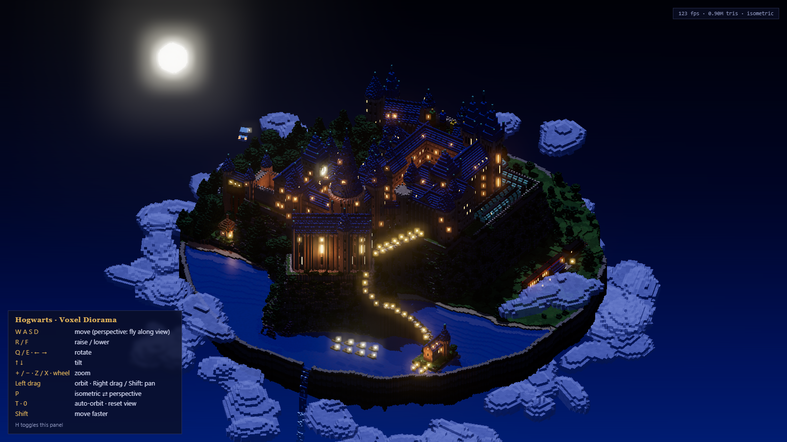
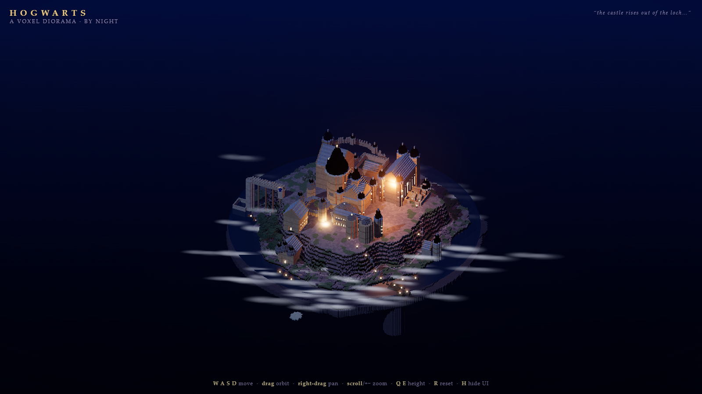
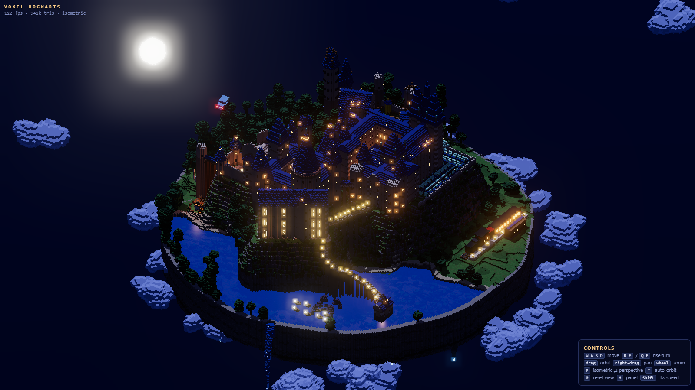
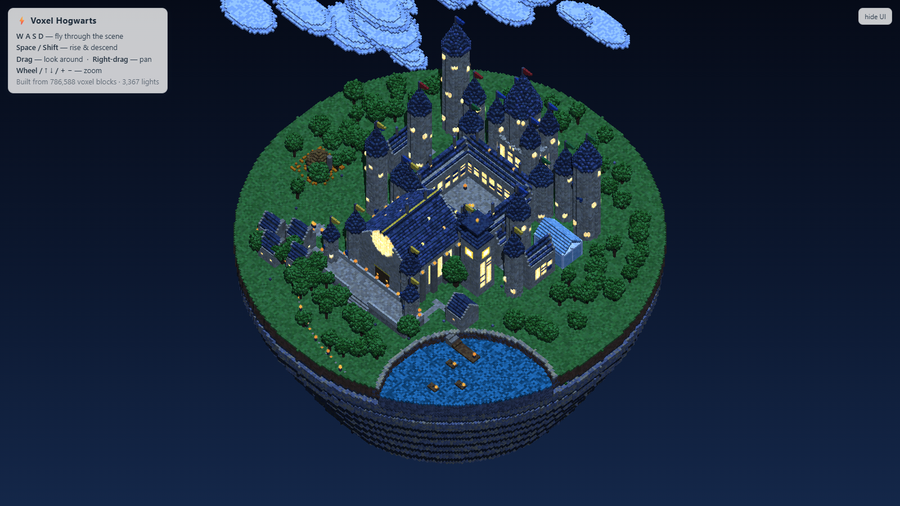
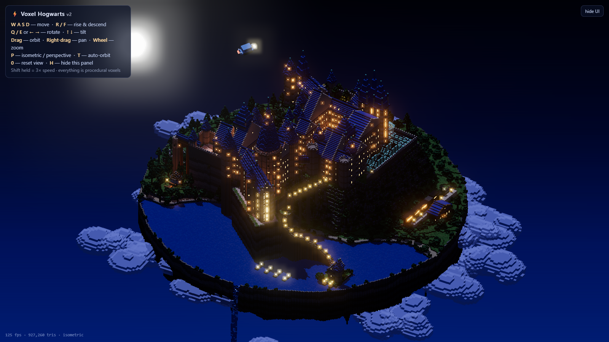
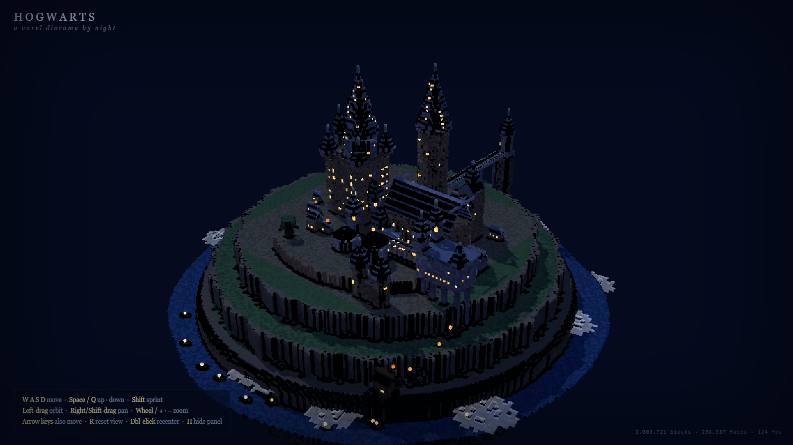
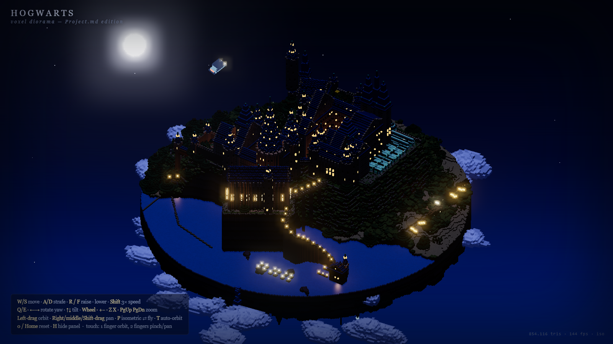

# Voxel Hogwarts: a capability test for locally running LLMs

This repository collects the results of a coding capability test for **large language models running locally** (self-hosted on a two-node NVIDIA DGX Spark cluster, not a cloud API).

Each model got the same one-paragraph prompt ([`prompt.txt`](GLM%20Voxel%20Hogwarts/Vorlage/prompt.txt)): build a single web page that renders a detailed, freely explorable **voxel-art diorama of Hogwarts** on a floating island, at night, with WASD, mouse and zoom camera controls. Everything had to be generated procedurally in code; the models were given reference images of the castle but no code and no assets.

Each model folder holds two attempts:

| File | What it is |
|---|---|
| `index.html` | The model's **native generation**: its own design and code, produced from the prompt alone. |
| `V2/index.html` (`v2/` for Qwen) | The model's **second build**, created with the project plan written by Claude Opus ([`PROJECT.md`](Opus%20Voxel%20Hogwarts/PROJECT.md)) as the basis. The plan specifies the architecture, file layout, island geometry, building list, mesher and lighting in detail, but contains no code, so the model still had to write the implementation itself. |

The `Opus Voxel Hogwarts` folder holds the reference build by Claude Opus, together with the plan it wrote from it. It is the benchmark for the V2 builds, not a local model.

## The models

| Folder | Model | Runs |
|---|---|---|
| `GLM Voxel Hogwarts` | GLM-5.3 | locally |
| `MiMo Voxel Hogwarts` | MiMo-V2.6-Flash-RL (NVFP4) | locally |
| `Qwen Voxel Hogwarts` | Qwen3.8 Flash-Next | locally |
| `Opus Voxel Hogwarts` | Claude Opus (reference and plan author) | cloud |

## Screenshots

Default camera view of each page after loading, rendered at 1600 × 900.

### Reference: Claude Opus


### GLM-5.3
| Native generation (`index.html`) | Built from the Opus plan (`V2/index.html`) |
|---|---|
|  |  |

### MiMo-V2.6-Flash-RL
| Native generation (`index.html`) | Built from the Opus plan (`V2/index.html`) |
|---|---|
|  |  |

### Qwen3.8 Flash-Next
| Native generation (`index.html`) | Built from the Opus plan (`v2/index.html`) |
|---|---|
|  |  |

## Running the scenes

Most pages load three.js r160 from jsDelivr through ES modules and an import map, so serve them over HTTP; opening them with `file://` doesn't work. From the repository root:

```bash
python -m http.server 8731
```

Then open for example `http://localhost:8731/GLM%20Voxel%20Hogwarts/V2/index.html`. The V2 builds are assembled from `src/` with `sh build.sh`, but a built `index.html` is already included.

## Notes

- **Reference images are not included.** The prompt and the plan refer to images in a `Vorlage/` folder (mood renders, a plan view and elevations of the castle). They are left out on purpose because some of them are copyrighted. The prompt and the plan are included unchanged.
- Files like `_repair_helpers.py`, `_tune7.py` or `.zcodeignore` are leftovers from the models' working sessions and are kept as they were produced.
- This is an unofficial fan-made technical test. Harry Potter and Hogwarts are trademarks of Warner Bros. Entertainment Inc.; this project is not affiliated with or endorsed by them. The bundled `three.min.js` files are three.js (MIT License).
